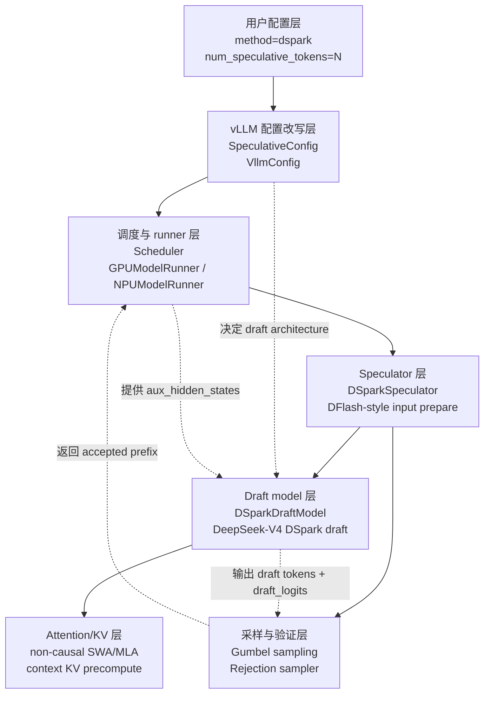
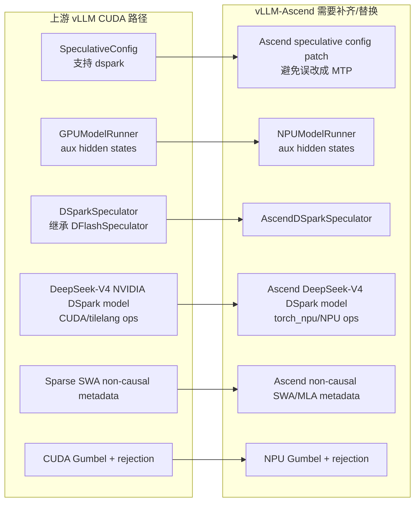
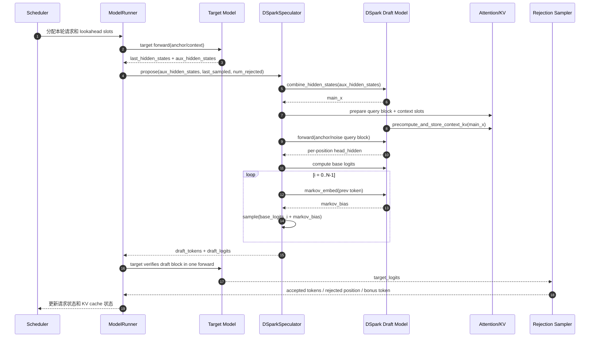
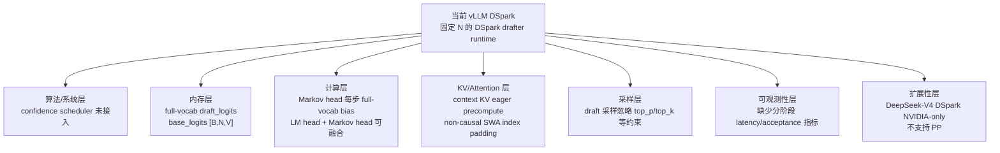

# DSpark 指定章节独立阅读版

> 来源：`DSpark_paper_zh_detailed.md`。本文件只抽取并串联用户指定章节：`1.5.1`、`6.2`、`6.3`、`6.4`、`6.5`、`7`、`8`、`20.10`、`20.11`、`20.13.1`。

## 阅读说明

这份文档的目标是把分散在原文不同位置的关键章节单独整理成一条连续主线，方便围绕 DSpark 算法和 vLLM 实现做集中阅读。整理时做了三类改动：

- 保留指定章节的主体正文、公式、表格、代码块和 Mermaid 图，不主动压缩内容。
- 统一章节层级，把被抽取章节提升为独立文档中的主要部分。
- 在各部分开头增加“承接说明”，帮助上下文自然衔接。

## 阅读主线

```text
投机推理 roadmap
  -> DSpark 两阶段生成：parallel backbone + sequential head
  -> Markov/RNN head：如何给 draft logits 加前缀修正
  -> 完整 draft 流程：哪些并行，哪些顺序
  -> confidence 与硬件感知调度：决定验证多长
  -> vLLM commit 与调用链：代码如何落地
  -> 当前实现优化点：后续适配 vLLM-Ascend 的优先级
```

## 目录

- 第一部分：1.5.1 一条简化 roadmap
- 第二部分：6.2 DSpark 的两阶段生成
- 第三部分：6.3 Markov head：只看前一个 token 的轻量修正
- 第四部分：6.4 RNN head：记住更长的块内历史
- 第五部分：6.5 一次完整 draft 生成流程：哪些并行，哪些顺序
- 第六部分：7. 置信度调度式验证：DSpark 的第二个核心
- 第七部分：8. 硬件感知前缀调度器
- 第八部分：20.10 两个 vLLM DSpark commit 做了什么
- 第九部分：20.11 vLLM 中一次 DSpark 推理的调用链
- 第十部分：20.13.1 当前 vLLM DSpark 实现还能优化什么


---

> 承接说明：这一部分先给整篇技术线索定坐标：投机推理并不是单一算法，而是一条围绕“草稿从哪里来、草稿是否连贯、验证是否划算”不断演进的路线。

## 第一部分：1.5.1 一条简化 roadmap

下面这条路线不是严格按论文年份排队，而是按思想演进来理解：

```text
普通自回归解码
  每次 target model 只生成 1 个 token，最稳但慢。

经典 speculative decoding
  小 draft model 先猜几个 token，target model 一次验证。
  关键问题：draft model 要便宜且接近 target。

MTP / 多 token 预测头
  在模型内部增加预测未来多个 token 的能力。
  常见直觉：不用另起一个小模型，而是在 target 模型旁边长出“未来 token 预测分支”。

EAGLE / EAGLE3
  利用 target model 的中间特征做更强的自回归草稿。
  关键直觉：不要只在 token id 上猜，借 target hidden states 帮忙。

DFlash / 并行 block drafter
  一次 forward 预测整个草稿 block，draft latency 对 block size 不敏感。
  关键问题：多个位置没有基于实际采样前缀条件化，后缀容易衰减。

DSpark
  继承 DFlash 式并行 backbone，再加轻量 Markov/RNN head 补一点块内依赖。
  同时增加 confidence scheduler，按负载动态决定验证多长。
```

更短一点说：

```text
MTP / EAGLE / EAGLE3：更偏“怎么生成高质量草稿”
DFlash：更偏“怎么一次快速生成长草稿”
DSpark：既要长草稿快，也要后缀更连贯，还要线上验证不浪费
```


---

> 承接说明：从 roadmap 进入 DSpark 本体后，先看它最核心的模型结构：并行 backbone 负责一次性给多个位置打基础分，顺序 head 再根据真实前缀补修正。

## 第二部分：6.2 DSpark 的两阶段生成

先回答你最关心的问题：**是的，在这篇论文的实现里，DSpark 第一步的 parallel backbone 基本就是 DFlash**。论文原文说：

```text
Parallel stage. A parallel backbone (in our instantiation, DFlash) ...
```

也就是说，DSpark 没有从零发明一个并行草稿主干，而是在 DFlash 这类并行 block drafter 的基础上，加了后面的 sequential head 和 confidence scheduler。

### 6.2.1 backbone 是什么

`backbone` 这个词在深度学习里通常表示“主干网络”。比如一个图像模型里，ResNet/ViT 主体可以叫 backbone；在 DSpark 这里，backbone 指的是 draft model 里负责主要计算的那一串 Transformer/MoE 层。

它不是 target model 本身，而是一个 draft-side 的主干：

```text
target model:
  大模型，负责最终验证，输出 target distribution p_t

draft backbone:
  小一些/便宜一些的草稿主干，负责快速产生 draft hidden states 和 base logits
```

DSpark 中的 parallel backbone 做两件事：

```text
1. 对整个 draft block 一次 forward
2. 输出每个草稿位置的：
   - hidden state h_k
   - base logits U_k
```

其中：

- `h_k` 是第 `k` 个草稿位置的隐藏表示。
- `U_k` 是第 `k` 个草稿位置对整个词表的基础打分。
- `U_k(v)` 表示在第 `k` 个位置，backbone 给 token `v` 的基础 logit 分数。

可以把 backbone 理解成“第一轮粗评委”：它先不管当前 block 中前面实际采样了什么，只根据 anchor、mask 位置和 target 上下文特征，给每个位置的所有候选 token 打一个基础分。

### 6.2.2 DFlash 到底做了什么

DFlash 是并行 block drafter。它的目标是：

```text
不要一步一步生成 draft token，
而是一次 forward 生成一整个 block 的 logits。
```

但是如果 draft model 完全独立，质量可能不够接近 target model。DFlash 的关键是：**把 target model 的上下文特征注入 draft model**。论文里叫 KV injection。

先看 target model 在 prefill / 上下文阶段产生的 hidden states。假设取 target model 的若干层：

```text
H^(l_1), H^(l_2), ..., H^(l_m)
```

DFlash 把这些层的 hidden states 拼接起来，再投影到 draft hidden space：

```text
H_ctx = RMSNorm(W_c [H^(l_1); ...; H^(l_m)])
```

这里：

- `H_ctx`：target model 上下文特征压缩/投影后的表示。
- `[H^(l_1); ...; H^(l_m)]`：把多个 target 层的 hidden states 拼起来。
- `W_c`：投影矩阵，把拼接后的大向量投到 draft model 使用的维度。
- `RMSNorm`：归一化，让特征尺度更稳定。

然后，DFlash 在 draft model 每一层 attention 的 key/value 里注入这些上下文特征：

```text
K_i = [W_i^K H_ctx; W_i^K H_d]
V_i = [W_i^V H_ctx; W_i^V H_d]
```

这里：

- `H_d`：draft block 自己的 hidden states。
- `W_i^K H_d`、`W_i^V H_d`：draft block 自己产生的 K/V。
- `W_i^K H_ctx`、`W_i^V H_ctx`：target 上下文特征产生的 K/V。
- 分号 `;` 表示沿 sequence 维度拼接。

朴素理解：

```text
普通 draft attention:
  draft token 只能看 draft block 内部的信息。

DFlash KV injection:
  draft token 不仅看 draft block 内部，
  还能在 attention 里看 target model 的上下文特征。
```

这就是为什么 DFlash 比普通小 draft model 更强：它不是闭着眼睛猜，而是拿到了 target model 的丰富上下文提示。

### 6.2.3 DFlash 为什么还是会后缀衰减

DFlash 的 block 内位置是并行预测的。它输入大致是：

```text
anchor token + mask token + mask token + ...
```

然后一次 forward 输出每个 mask 位置的 logits。问题在于：

```text
位置 2 预测时，并不知道位置 1 最后实际采样了什么；
位置 3 预测时，也不知道位置 1、2 实际采样了什么。
```

虽然 block 内位置可以双向 attention，但那是在 hidden 表示层面同时计算；它不是“先采样位置 1，再把位置 1 的真实 token 喂给位置 2”。因此，它缺少“已采样前缀”的因果条件。

这就是 suffix decay 的根源：

```text
DFlash 有 target context，所以第一步很强；
但越往后，越需要知道前面实际选了什么；
纯并行位置没有这个真实前缀信息，所以后缀容易不连贯。
```

### 6.2.4 DSpark 对 DFlash 做了什么改动

DSpark 的并行阶段采用 DFlash backbone，但有一个小改动。原始 DFlash 更像：

```text
输入：anchor + gamma 个 mask
输出：gamma 个 mask 位置的 logits
```

DSpark 改成：

```text
输入：anchor + (gamma - 1) 个 mask
输出：gamma 个 draft logits
```

也就是说，DSpark 把 anchor 自己也当作第一个预测位置来处理。论文说这样可以减少 draft computation，同时保持类似草稿质量。

更重要的是，DSpark 在 DFlash 输出后增加了 sequential stage。

DSpark 把草稿生成拆成：

```text
并行阶段：一次产生每个位置的基础 logits 和 hidden states
顺序阶段：从左到右采样，同时给 logits 加前缀相关 bias
```

可以把并行阶段看成“每个位置先给出初稿意见”，顺序阶段看成“根据前面已经选出来的词，给后面位置做微调”。

### 6.2.5 从公式看两阶段生成

论文先把整个 block 的生成写成自回归分解：

```text
P(X | x_0) = ∏_{k=1}^{γ} p_k(x_k | x_0, x_<k)
```

意思是：

```text
虽然 backbone 的重计算是并行完成的，
但真正采样 draft token 时，
还是按照 x_1 -> x_2 -> ... -> x_γ 的顺序采样。
```

第 `k` 步的条件分布是：

```text
p_k(v | x_0, x_<k)
  = softmax(U_k(v) + B_k(x_0, x_<k, v))
```

先把符号拆开：

| 符号 | 含义 |
|---|---|
| `k` | 当前正在生成 block 中第几个 draft token |
| `v` | 词表里的某个候选 token |
| `x_0` | anchor token，也就是上一轮 target model 生成的可靠 token |
| `x_<k` | 当前 block 中第 `k` 个位置之前已经采样出的 draft token |
| `U_k(v)` | parallel backbone 给位置 `k`、候选 token `v` 的基础 logit |
| `B_k(x_0, x_<k, v)` | sequential head 根据已采样前缀给 `v` 加的修正 bias |
| `p_k(v | x_0, x_<k)` | 最终用于采样第 `k` 个 token 的概率 |

这个公式可以分三步理解。

第一步，DFlash/parallel backbone 给出基础分：

```text
U_k(v)
```

这表示：

```text
如果不考虑当前 block 里前面真实采样了什么，
第 k 个位置选 token v 看起来有多合适？
```

第二步，sequential head 给出前缀修正：

```text
B_k(x_0, x_<k, v)
```

这表示：

```text
已知 anchor 是 x_0，
并且 block 里前面已经采样出 x_<k，
那么 token v 应该被加多少分或减多少分？
```

第三步，把两者相加后 softmax：

```text
最终 logit = U_k(v) + B_k(...)
最终概率 = softmax(最终 logit)
```

所以朴素理解不是一句空话，而是严格对应公式：

```text
最终分数
= 并行模型根据 target context 和 mask 位置给出的基础判断
+ 顺序 head 根据已采样前缀给出的连贯性修正
```

举个极简数字例子。假设当前要生成第 2 个 token，词表里只看两个候选：

```text
course
problem
```

parallel backbone 的基础分是：

```text
U_2(course)  = 2.0
U_2(problem) = 1.8
```

这说明只看并行 backbone，它觉得 `course` 略好，但 `problem` 也很接近。

如果第 1 个 token 已经采样出：

```text
of
```

Markov/sequential head 可能给出：

```text
B(of, course)  = +1.0
B(of, problem) = -1.0
```

那么最终分数变成：

```text
course:  2.0 + 1.0  = 3.0
problem: 1.8 - 1.0  = 0.8
```

softmax 后 `course` 概率会明显变高，`problem` 会明显变低。这就是“加分/减分”的具体含义：它不是手工规则，而是 sequential head 学出来的一组 logit bias，直接加到 backbone 的 logits 上。


---

> 承接说明：理解了 `U_k + B_k` 之后，下一步就是把 `B_k` 展开。Markov head 是 DSpark 默认使用的轻量顺序修正方式，也是当前 vLLM 实现里最关键的一段采样逻辑。

## 第三部分：6.3 Markov head：只看前一个 token 的轻量修正

Markov head 是默认版本。它只看上一个 token。

例如已经采样：

```text
of
```

那么下一个 token：

```text
course
```

应该被加分，而：

```text
problem
```

应该被减分。

如果前一个 token 是：

```text
no
```

那么：

```text
problem
```

应该被加分。

这就是一阶转移：只看 `x_{k-1}` 对 `x_k` 的影响。

### 6.3.1 Markov head 的公式

论文中的 Markov head 把修正项限制为：

```text
B_k(x_0, x_<k, v) = B(x_{k-1}, v)
```

也就是说，它不看完整前缀，只看前一个 token `x_{k-1}`。如果把所有“前一个 token -> 当前 token”的转移偏好都存下来，理论上可以学一个巨大矩阵：

```text
前一个 token x 当前 token
```

如果词表有 10 万个 token，这个矩阵就是：

```text
100000 x 100000
```

太大了。DSpark 用低秩分解：

```text
B = W1 W2
```

更具体地说：

```text
W1 ∈ R^{V × r}
W2 ∈ R^{r × V}
B(x_{k-1}, ·) = W1[x_{k-1}] W2 ∈ R^V
```

其中：

- `W1[x_{k-1}]` 像查表，取出前一个 token 的小向量。
- `W2` 把这个小向量投影回整个词表，得到对每个候选 token 的 bias。
- `V` 是词表大小。
- `r` 是低秩维度，论文默认 `r=256`。

完整展开就是：

```text
前一个 token = x_{k-1}

prev_vec = W1[x_{k-1}]          # shape: r
bias_vec = prev_vec @ W2        # shape: V

对每个候选 token v:
  B(x_{k-1}, v) = bias_vec[v]
```

然后当前 token 的最终 logit 是：

```text
final_logit_k(v) = U_k(v) + bias_vec[v]
```

如果 `bias_vec["course"]` 是正数，就相当于给 `course` 加分；如果 `bias_vec["problem"]` 是负数，就相当于给 `problem` 减分。

### 6.3.2 “加分/减分”是怎么学出来的

这些加分和减分不是人工写规则，而是在训练中通过 loss 学出来的。训练目标会鼓励 draft distribution 接近 target distribution。于是模型会逐渐学到：

```text
前一个 token 是 "of" 时：
  "course" 经常符合 target 分布 -> bias 变大
  "problem" 经常不符合 target 分布 -> bias 变小

前一个 token 是 "no" 时：
  "problem" 经常符合 target 分布 -> bias 变大
  "course" 经常不符合 target 分布 -> bias 变小
```

可以把 Markov head 想成一个神经网络版的“大型搭配表”：

```text
给定前一个 token，
它输出一整张词表的偏好修正。
```

但它不是普通词频表，因为这个 bias 会和 parallel backbone 的 `U_k` 相加。backbone 仍然负责理解长上下文、位置和 target features；Markov head 只负责补一层很便宜的局部转移偏好。

### 6.3.3 为什么低秩分解足够便宜

如果直接存完整矩阵：

```text
V × V
```

词表 `V=100000` 时就是 100 亿级别参数，完全不现实。

低秩分解后参数量是：

```text
V × r + r × V = 2Vr
```

如果 `r=256`，大约是：

```text
2 × 100000 × 256 ≈ 5120 万
```

这仍然不小，但比 100 亿级别小得多，而且每一步只需要：

```text
一次 W1 查表 + 一次小向量到词表的投影
```

相比完整 Transformer forward，这个顺序开销很低。


---

> 承接说明：Markov head 只看前一个 token，足够简单也足够便宜。如果想让顺序修正记住更长的块内历史，就会走到 RNN head。

## 第四部分：6.4 RNN head：记住更长的块内历史

Markov head 只看前一个 token。如果有些依赖跨度更长，就不够了。

例如：

```text
if 用户 已经 登录 ， 那么
```

后面生成什么可能依赖更早的“if”和“登录”，不只是前一个 token。

RNN head 用一个小状态 `s_k` 记录 block 内已经采样的历史。每一步把：

- 上一步状态 `s_{k-1}`
- 前一个 token embedding
- 并行 backbone 的 hidden state `h_k`

拼在一起，更新成新的状态，再输出 bias。

### 6.4.1 RNN head 的公式

论文里 RNN head 的输入向量是：

```text
z_k = [s_{k-1}; W1[x_{k-1}]; h_k] ∈ R^{2r+d}
```

这里：

- `s_{k-1}`：到上一个位置为止的块内历史状态，维度 `r`。
- `W1[x_{k-1}]`：前一个 token 的 embedding，维度 `r`。
- `h_k`：parallel backbone 在第 `k` 个位置输出的 hidden state，维度 `d`。
- `z_k`：把三者拼起来后的输入。

然后它做一次门控更新：

```text
s_k =
  σ(W_g z_k) ⊙ s_{k-1}
  + (1 - σ(W_g z_k)) ⊙ tanh(W_c z_k)
```

这个式子可以按 GRU 风格理解：

```text
gate = σ(W_g z_k)
candidate = tanh(W_c z_k)

s_k = gate * old_state + (1 - gate) * candidate
```

其中：

- `gate` 接近 1：更多保留旧记忆 `s_{k-1}`。
- `gate` 接近 0：更多写入新信息 `candidate`。
- `⊙` 表示逐元素相乘。

最后，RNN head 产生当前词表上的 bias：

```text
B_k(x_<k, ·) = W2^T tanh(W_o z_k)
```

拆开理解：

```text
out_vec = tanh(W_o z_k)      # shape: r
bias_vec = W2^T out_vec      # shape: V
final_logit_k(v) = U_k(v) + bias_vec[v]
```

这里如果按工程实现里的行向量写法，也可以理解成：

```text
bias_vec = out_vec @ W2
```

论文写成 `W2^T tanh(...)`，本质都是把一个 `r` 维向量投影成 `V` 维词表 bias。不要被转置方向卡住，关键是输出必须是一整张词表上的加减分。

也就是说，RNN head 和 Markov head 最终做的事情一样：都输出一个词表大小的 `bias_vec`，加到 `U_k` 上。区别在于：

```text
Markov head:
  bias 只由前一个 token 决定。

RNN head:
  bias 由完整块内历史状态 + 前一个 token + 当前 backbone hidden 共同决定。
```

### 6.4.2 RNN head 比 Markov head 多记住什么

Markov head 的记忆长度是 1：

```text
B(x_{k-1}, v)
```

它适合处理短搭配：

```text
of -> course
New -> York
machine -> learning
```

RNN head 的状态 `s_k` 可以累积更长历史。例如前面生成了：

```text
if 用户 已经 登录 ， 那么
```

此时后面应该生成的内容不只取决于前一个 token “那么”，也取决于更早的 “if”“登录”等信息。RNN head 的 `s_k` 就是为了把这些块内历史压缩进一个状态里。

但代价是：

- 实现更复杂。
- 每个位置都要更新 recurrent state。
- 对推理框架和 kernel 融合不如 Markov head 友好。

论文实验发现，RNN head 在更长 proposal length 下只有小幅额外收益。综合部署复杂度和收益，DSpark 默认使用 Markov head。


---

> 承接说明：前面几节分别解释了 backbone、Markov head、RNN head。这一节把它们串成一次完整 draft 生成流程，重点分清“并行算 logits”和“顺序采样 token”不是一回事。

## 第五部分：6.5 一次完整 draft 生成流程：哪些并行，哪些顺序

到这里可以把 DSpark 的 draft 生成流程串起来。一个很容易误解的点是：

```text
DFlash 并行生成 k 个位置的基础 logits，
并不等于 k 个 token 完全独立地同时采样完。
```

更准确的过程是：

```text
第 1 步：parallel backbone / DFlash-style backbone
  一次 forward 生成 k 个位置的基础 logits：
  U_1, U_2, ..., U_k

第 2 步：sequential head
  用 Markov 或 RNN head 从左到右给每个位置加 bias。

第 3 步：softmax + sampling
  每个位置用 final_logits_k 得到 draft distribution p_d，
  再采样出 draft token x_k。
```

如果默认使用 Markov head，可以写成：

```text
位置 1:
  final_logits_1(v) = U_1(v) + B(x_0, v)
  x_1 ~ softmax(final_logits_1)

位置 2:
  final_logits_2(v) = U_2(v) + B(x_1, v)
  x_2 ~ softmax(final_logits_2)

位置 3:
  final_logits_3(v) = U_3(v) + B(x_2, v)
  x_3 ~ softmax(final_logits_3)
```

这里 `x_0` 通常可以理解为 anchor token。也就是说：

- `U_1, U_2, ..., U_k` 的重计算是并行的。
- 但 `x_1, x_2, ..., x_k` 的采样会带一点从左到右的顺序性。
- 这种顺序性很轻，因为 Markov head 只做查表、低秩投影和 logits 加法，不是重新跑完整 Transformer。

所以 DSpark 的“半自回归”可以更朴素地理解为：

```text
重活并行做：
  先把每个位置的大致分数 U_k 都算出来。

轻活顺序做：
  再根据前一个实际采样 token，给当前位置的候选 token 加分/减分。
```

采样出一串 draft token 后，还不能直接说“target 一定会接受几个”。在真正跑 target verification 之前，DSpark 只能通过 confidence head 估计接受概率。

confidence head 预测的是条件接受概率：

```text
c_1 = P(x_1 被接受)
c_2 = P(x_2 被接受 | x_1 已被接受)
c_3 = P(x_3 被接受 | x_1, x_2 已被接受)
...
```

于是前缀存活概率是：

```text
a_1 = c_1
a_2 = c_1 * c_2
a_3 = c_1 * c_2 * c_3
```

`a_3` 的含义不是“第 3 个 token 自己被接受的概率”，而是：

```text
前 3 个 draft token 全部被接受的概率。
```

如果你想看“恰好接受几个 token”的概率，可以从这些条件概率推出来：

```text
恰好接受 0 个：1 - c_1
恰好接受 1 个：c_1 * (1 - c_2)
恰好接受 2 个：c_1 * c_2 * (1 - c_3)
恰好接受 3 个：c_1 * c_2 * c_3
```

但 scheduler 通常更关心 `a_1, a_2, ..., a_k`，因为 speculative decoding 只能接受连续前缀。第 3 个 token 想被接受，前 1、2 个必须已经被接受。

最后，scheduler 决定送几个 token 给 target model 验证。这个决策不是简单的固定阈值：

```text
confidence > 0.8 就验证
confidence <= 0.8 就不验证
```

而是看：

```text
这个前缀 token 的预期收益
vs
把它放进 target verification batch 后增加的系统成本
```

轻载时，GPU 还有空，scheduler 可能多验证几个 token；重载时，target batch capacity 很珍贵，scheduler 会只保留最有希望通过的连续前缀。

真正“接受几个 token”的结果，要等 target model 验证后才知道。target verification 会拿 target distribution `p_t` 和 draft distribution `p_d` 做拒绝采样：

```text
accept_prob = min(1, p_t(x_k) / p_d(x_k))
```

这里的 `p_d` 必须是加完 Markov/RNN bias 后的最终 draft 概率，而不是 DFlash backbone 的原始基础概率。


---

> 承接说明：到这里，模型已经能生成更连贯的 draft block。但线上 serving 还要回答另一个问题：这一轮草稿到底值得送多少 token 给 target model 验证？

## 第六部分：7. 置信度调度式验证：DSpark 的第二个核心

### 7.1 为什么不能总是验证全部草稿

假设 draft model 每轮都生成 5 个 token。要不要都给 target model 验证？

低并发时：

```text
GPU 还有空闲
多验证几个 token 就算错了也不太亏
```

高并发时：

```text
很多请求排队
每个多验证的 token 都占用 batch 容量
如果这些 token 大概率会错，就很亏
```

所以固定验证长度并不理想。更好的策略是：

```text
当前请求的草稿很可靠 -> 多验证几个
当前请求的草稿不可靠 -> 少验证几个
系统负载低 -> 可以宽松一点
系统负载高 -> 只验证高收益 token
```

这就是 DSpark 的 confidence-scheduled verification。

### 7.2 confidence head 预测什么

confidence head 给每个位置输出一个数：

```text
c_k in (0, 1)
```

论文里这一节其实有两个容易混在一起的公式。第一个公式描述 **模型怎么预测 confidence**：

```text
c_k = σ(w^T [h_k; W_1[x_{k-1}]])
```

这个式子可以从右往左读：

- `x_{k-1}`：前一个已经采样出来的 draft token。第一个位置可以把 anchor token 当作 `x_0`。
- `W_1[x_{k-1}]`：查表得到前一个 token 的小向量。它和 Markov head 里的 token embedding 思路一致，用来告诉 confidence head：“当前草稿路径前一步实际选了什么”。
- `h_k`：parallel backbone 在第 `k` 个位置输出的 hidden state。它包含上下文、当前位置、draft backbone 对这个位置的内部表示。
- `[h_k; W_1[x_{k-1}]]`：把这两个向量拼起来。
- `w^T[...]`：一个轻量线性层，把拼接后的向量压成一个标量分数。
- `σ`：sigmoid 函数，把任意实数压到 `(0, 1)`，于是可以当概率使用。

所以 confidence head 不是重新跑一个大模型，而是一个很便宜的小头：

```text
当前位置的 hidden state
+ 前一个实际采样 token 的信息
-> 一个 0 到 1 之间的接受概率估计
```

它预测的也不是简单的“这个 token 看起来好不好”，而是条件概率：

```text
如果前面的 token 都已经被接受，
第 k 个 token 被接受的概率是多少？
```

例如 draft 是：

```text
去 图书馆 看 书
```

confidence 可能是：

```text
去       c1 = 0.95
图书馆   c2 = 0.90
看       c3 = 0.60
书       c4 = 0.50
```

那么前缀存活概率是累计乘积：

```text
第 1 个 token 存活：0.95
前 2 个都存活：0.95 * 0.90 = 0.855
前 3 个都存活：0.95 * 0.90 * 0.60 = 0.513
前 4 个都存活：0.95 * 0.90 * 0.60 * 0.50 = 0.2565
```

注意第 4 个 token 自己的 `c4=0.50` 看起来还行，但作为“前 4 个都通过”的概率只有 0.2565。因为它依赖前面全部通过。

这里要注意一个细节：论文有时会说 confidence head 估计 prefix survival probability，但更严谨地拆开看：

```text
confidence head 直接输出：条件接受概率 c_k
scheduler 使用：前缀存活概率 a_k = c_1 * c_2 * ... * c_k
```

也就是说，`c_k` 是一步一步的条件概率，`a_k` 才是“前 k 个 token 都能活下来”的概率。

### 7.3 confidence 的训练标签从哪里来

第二个公式描述 **训练时用什么标签监督这个 confidence**：

```text
c*_k = 1 - 1/2 * ||p_d_k - p_t_k||_1
```

这里：

- `c_k`：confidence head 预测出来的概率。
- `c*_k`：训练时希望它学到的目标值，也就是软标签。
- `p_d_k`：draft model 在第 `k` 个位置给出的概率分布。
- `p_t_k`：target model 在同一位置给出的概率分布。
- `||p_d_k - p_t_k||_1`：两个分布逐 token 相减、取绝对值、再求和。

这个公式来自 total variation distance。对两个概率分布来说：

```text
TV(p_d, p_t) = 1/2 * ||p_d - p_t||_1
```

所以：

```text
c*_k = 1 - TV(p_d_k, p_t_k)
```

直觉是：

- 如果 draft 分布和 target 分布很像，说明 draft 很可靠，接受概率高。
- 如果两个分布差很多，说明 draft 容易被 target 拒绝，接受概率低。

更进一步，这个值其实等价于两个分布的重叠面积：

```text
c*_k = sum_v min(p_d_k(v), p_t_k(v))
```

为什么这和接受率有关？回忆 speculative decoding 的单 token 接受概率：

```text
draft 抽到 token v 的概率：p_d(v)
抽到 v 后被接受的概率：min(1, p_t(v) / p_d(v))
```

所以 token `v` 对总接受率的贡献是：

```text
p_d(v) * min(1, p_t(v) / p_d(v))
= min(p_d(v), p_t(v))
```

把所有 token 的贡献加起来，就是：

```text
sum_v min(p_d(v), p_t(v))
= 1 - 1/2 * ||p_d - p_t||_1
```

这就是论文说的 analytical acceptance rate，也就是“解析接受率”。它不是一次采样后的 0/1 结果，而是根据 draft 分布和 target 分布直接算出的期望接受概率。

举个小例子，只看三个候选 token：

```text
token        A     B     C
p_d       0.6   0.3   0.1
p_t       0.5   0.2   0.3
min       0.5   0.2   0.1
```

那么：

```text
c* = 0.5 + 0.2 + 0.1 = 0.8
```

也就是说，虽然 draft 和 target 不完全一样，但它们有 80% 的分布重叠；按拒绝采样规则，平均来看这个位置有大约 80% 的概率能被接受。

为什么不用“这个 token 最后是否真的被接受”作为硬标签？因为硬标签太吵：

```text
同一个分布下，这次采样可能接受，下次采样可能拒绝。
```

而 `c*_k` 使用完整分布，直接告诉模型：

```text
draft 分布和 target 分布在这个位置到底重叠多少。
```

这比单次 accepted/rejected 的 0/1 标签更平滑，也更贴近 scheduler 真正需要的“期望收益”。

于是 confidence head 的训练目标可以理解成：

```text
让模型预测的 c_k 尽量接近解析标签 c*_k。
```

后面第 9 章里的 confidence loss，就是用 binary cross entropy 让 `c_k` 拟合这个软标签 `c*_k`。

### 7.4 为什么要校准

神经网络常常过度自信。例如它说：

```text
我有 90% 把握
```

但真实统计下来可能只有 75%。

如果只是排序，过度自信问题没那么严重。比如我们只要知道 A 比 B 可靠就行。但是 DSpark scheduler 要计算：

```text
预期接受 token 数 * 当前 batch size 下的 steps per second
```

这需要概率数值本身可信。0.9 和 0.7 的差别会直接影响是否值得验证后缀。

所以论文使用 Sequential Temperature Scaling（STS）校准。可以理解为给每个位置的 confidence 做温度修正，让预测概率和真实接受率对齐，同时不改变排序。


---

> 承接说明：confidence head 给出了每个前缀的预期通过概率。硬件感知调度器则把这个概率和真实 batch 吞吐曲线结合起来，决定验证预算如何分配。

## 第七部分：8. 硬件感知前缀调度器

### 8.1 它要优化什么

一次 target verification 会把多个请求的 token 合在一个 batch 里跑。假设有 `R` 个请求，每个请求都至少要让 target model 生成或验证一个 token，因此基础 batch size 是 `R`。

如果给某个请求多验证一个 draft token，batch size 就多 1。验证更多 token 可能增加 accepted length，但也可能让 target forward 变慢。

调度器的目标是最大化：

```text
Theta = tau * SPS(B)
```

其中：

- `tau`：这一批请求预期总共能产出多少被接受 token。
- `B`：target model 这一步要处理的 token 数。
- `SPS(B)`：batch size 为 `B` 时，引擎每秒能跑多少 step。

朴素理解：

```text
总吞吐 = 每一步能产出多少有效 token * 每秒能跑多少步
```

### 8.2 一个小例子

假设当前有 2 个请求：

```text
请求 A 的前缀存活概率：
A1 = 0.90
A2 = 0.72
A3 = 0.30

请求 B 的前缀存活概率：
B1 = 0.85
B2 = 0.40
B3 = 0.10
```

如果 GPU 很空，scheduler 可能验证：

```text
A 验 2 个
B 验 2 个
```

因为额外 token 的机会成本低。

如果 GPU 很忙，scheduler 可能只验证：

```text
A 验 2 个
B 验 1 个
```

甚至：

```text
A 验 1 个
B 验 1 个
```

因为 `A3=0.30`、`B2=0.40`、`B3=0.10` 这些 token 预期收益不够高。

### 8.3 为什么按前缀存活概率排序是合理的

对同一个请求来说，越往后的前缀存活概率不会更高：

```text
a_{r,1} >= a_{r,2} >= a_{r,3} ...
```

因为每往后一步都要乘一个小于等于 1 的 confidence。

所以可以把所有请求的候选扩展放在一个池子里，按 `a_{r,j}` 从大到小排序。高的先拿去验证，低的后拿。

但是还要注意前缀约束：

```text
不能验证第 3 个 token，却不验证第 1、2 个 token
```

累计存活概率的单调性保证了全局排序不会破坏这个约束：同一请求中第 1 个一定排在第 2 个前，第 2 个一定排在第 3 个前。

### 8.4 算法 1 的朴素版本

论文算法可以解释为：

```text
1. 先假设每个请求都不验证 draft token，只让 target model 正常走一步
2. 计算当前吞吐
3. 把所有可能加入验证的 draft token 按收益排序
4. 一个一个尝试加入
5. 每加入一个，就更新：
   - 预期 accepted token 数
   - batch size
   - 查表得到 SPS(batch size)
   - 计算吞吐
6. 如果吞吐变好，就保留
7. 如果吞吐不变好，就停止
```

这个策略的本质是：

```text
把 target model 的验证预算分配给最值得验证的 token
```

### 8.5 为什么需要 early stopping 保证无损

这是论文中较难但很关键的一点。

无损 speculative decoding 要求：是否验证某个 token，不能依赖这个 token 采样出来之后的信息，更不能依赖未来 token。

举个简化例子：

```text
第 1 个 draft token 可能是 A 或 B
A 会让后面的 confidence 很高
B 会让后面的 confidence 很低
```

如果 scheduler 先偷看了第 1 个 token 是 A 还是 B，再决定要不要验证第 1 个 token，就会产生偏差：

- 看到 A：觉得后续收益高，于是验证 A。
- 看到 B：觉得后续收益低，于是不验证 B，让 target model 重新采样。

这样输出就会偏向 A，偏离 target model 原始分布。

论文附录用数字证明了这一点：

```text
target 分布：A 0.7, B 0.3
draft  分布：A 0.5, B 0.5
```

如果 scheduler 因为 A 后续置信高而接纳 A，因为 B 后续置信低而不接纳 B，最后输出 A 的概率会变成 0.85，而不是 target 的 0.7。

所以理论算法里，一旦吞吐不再提升就 early stop，避免继续看会依赖未来 token 的信息。

### 8.6 生产系统里怎么处理真实硬件曲线

理论算法假设 `SPS(B)` 比较平滑。但真实 GPU kernel 的吞吐曲线经常是锯齿状的。例如 batch size 从 127 到 128 可能很好，从 128 到 129 可能突然掉一下，因为底层矩阵计算、CUDA graph、kernel tile 都有离散边界。

如果严格 early stop，可能卡在局部点，错过后面更好的 batch size。

DeepSeek 的生产实现用了异步方案：

- 当前 step 的 token 仍按最新 confidence 排序。
- 但“这一步最多验证多少 token”的容量 `K` 用两步之前的信息预测。
- 这样调度不会偷看当前 token 的实现，仍保持因果。
- 同时可以做更自由的全局搜索，绕过锯齿状硬件曲线。

直觉上，这是把“容量规划”和“当前 token 选择”隔开：

```text
容量规划：用历史信息，避免偷看当前 token
token 选择：用当前 confidence 排序，优先验证最可靠 token
```


---

> 承接说明：算法侧讲完后，下面转到 vLLM 工程实现。先看两个 commit 分别补了哪些能力，避免把 DeepSeek-V4 DSpark、Qwen3 DSpark、Speculators 格式混在一起。

## 第八部分：20.10 两个 vLLM DSpark commit 做了什么

你提到的两个 commit 可以这样理解：

```text
f5a8d73377  [Spec Decode] DSpark (#46995)
2b753ad200  [Spec Decode] DSpark speculators checkpoint support (#47093)
```

第一个 commit 是主体接入。它新增或修改了这些关键能力：

| 模块 | 主要变化 |
|---|---|
| `vllm/config/speculative.py` | 增加 `method="dspark"`，自动把 DeepSeek-V4 target checkpoint 解释成 DSpark draft checkpoint，并设置 `parallel_drafting=True`。 |
| `vllm/config/vllm.py` | 强制 DSpark 走 V2 runner，因为 DSpark speculator 只在 V2 路径实现。 |
| `vllm/v1/core/sched/scheduler.py` | DSpark 的 lookahead token 数是 `N`，而不是 DFlash 的 `N+1`。 |
| `vllm/v1/worker/gpu/model_runner.py` | 对 `eagle3/dflash/dspark` 打开 target auxiliary hidden state 输出。 |
| `vllm/v1/worker/gpu/spec_decode/dspark/speculator.py` | 新增 DSpark speculator：复用 DFlash 并行 query block，再用 Markov head 顺序采样。 |
| `vllm/v1/worker/gpu/spec_decode/dflash/speculator.py` | 抽象出 `sample_from_anchor`，让 DSpark 可以在 anchor query 位置也采样。 |
| `vllm/models/deepseek_v4/nvidia/dspark.py` | 新增 DeepSeek-V4 专用 DSpark draft model，负责加载 `mtp.*` 权重、组合 target hidden states、预写 context KV、运行 draft layers 和 Markov head。 |
| `vllm/model_executor/models/qwen3_dspark.py` | 新增通用 Qwen3 DSpark draft model，用于 dense DSpark checkpoint。 |
| `vllm/v1/attention/backends/mla/sparse_swa.py` | 新增 DeepSeek-V4 DSpark 非因果 sliding-window MLA 索引构造。 |
| `vllm/v1/worker/gpu/sample/gumbel.py` | 为 DSpark sequential sampling 补了若干 contiguous 处理。 |

第二个 commit 更像补齐 checkpoint 兼容性：

| 模块 | 主要变化 |
|---|---|
| `vllm/transformers_utils/configs/speculators/algos.py` | 支持 Speculators 格式的 `dspark` checkpoint，把 config 转成 `Qwen3DSparkModel` 所需字段。 |
| `qwen3_dspark.py` | 支持 reduced draft vocab、`d2t/t2d` 映射、跳过未接入推理的 confidence head 权重。 |
| `dspark/speculator.py` | 支持 `dspark_bonus_anchor=True` 的 `1+N` block 形态，以及 reduced vocab probabilistic sampling。 |
| `deepseek_v4/nvidia/dspark.py` | 补充 DeepSeek-V4 DSpark 相关兼容字段。 |

这里要特别分清两类 DSpark：

1. **DeepSeek-V4-Flash-DSpark**：draft weights 混在 target checkpoint 的 `mtp.*` 权重里，vLLM 把 draft architecture 改成 `DSparkDraftModel`，真正实现位于 `vllm/models/deepseek_v4/nvidia/dspark.py`。
2. **Qwen3 DSpark / Speculators 格式 DSpark**：draft model 是单独 checkpoint，architecture 通常变成 `Qwen3DSparkModel`，实现位于 `vllm/model_executor/models/qwen3_dspark.py`。

你当前目录的 `config.json` 更接近第一类：DeepSeek-V4 target + checkpoint 内置 DSpark/MTP 权重。

### 20.10.1 先用一张地图定位代码

这一段代码最好不要一上来逐文件读。先把它看成 5 层：



用更朴素的话说：

```text
配置层：我是不是 DSpark？draft model 应该按哪个 architecture 加载？
调度层：我要给每个请求预留几个 lookahead slots？
runner 层：target forward 后，能不能把中间层 hidden states 带出来？
speculator 层：怎么把 target 的状态变成一段 draft query block？
draft model 层：怎么跑 DSpark backbone 和 Markov head？
attention/KV 层：draft block 的 KV cache 和非因果 attention 怎么处理？
采样验证层：draft logits 怎么保存，target 怎么无损验证？
```

所以读代码时不要把 `DSparkSpeculator` 当成孤立文件。它其实卡在中间，左边接调度和 target runner，右边接 draft model、attention cache 和 rejection sampler。

再看 vLLM 和 vLLM-Ascend 的关系，可以先记下面这张对照图：



这张图的核心意思是：vLLM-Ascend 不是“照搬上游 DSpark 文件”就结束。上游 DeepSeek-V4 DSpark model 里有 CUDA/tilelang 专用算子，Ascend 必须在模型、attention metadata、KV cache insert、图捕获和采样 patch 上都有自己的实现。


---

> 承接说明：知道 commit 做了什么之后，还需要把一次 decode step 的数据流串起来。这一节从 Scheduler、Runner、Target、Speculator、Draft Model、Attention/KV 到 Rejection Sampler 逐步展开。

## 第九部分：20.11 vLLM 中一次 DSpark 推理的调用链

先看一张时序图。图里不是逐行函数调用，而是一次 decode step 里主要数据怎么流动：



如果把这张图压缩成一句话：

```text
target 先给 DSpark 提供上下文特征；
DSpark 用这些特征一次性跑出 block hidden；
Markov head 再轻量顺序采样 draft tokens；
target 最后用 rejection sampler 决定接受多少。
```

再把“文件”和“图中的角色”对应起来：

| 图中角色 | 上游 vLLM 主要文件 | vLLM-Ascend 对应关注点 |
|---|---|---|
| Scheduler | `vllm/v1/core/sched/scheduler.py` | lookahead slots：DSpark 是 `N`，DFlash 是 `N+1`。 |
| ModelRunner | `vllm/v1/worker/gpu/model_runner.py` | Ascend `NPUModelRunner` 要支持 DSpark speculator 和 aux hidden states。 |
| Target Model | `vllm/models/deepseek_v4/.../model.py` | Ascend `deepseek_v4.py` 需要返回多层 aux hidden states。 |
| DSparkSpeculator | `vllm/v1/worker/gpu/spec_decode/dspark/speculator.py` | 需要新增 `AscendDSparkSpeculator`。 |
| DFlash input prepare | `vllm/v1/worker/gpu/spec_decode/dflash/speculator.py` | Ascend DFlash kernel 要补 `SAMPLE_FROM_ANCHOR`。 |
| DSpark Draft Model | `vllm/models/deepseek_v4/nvidia/dspark.py` | 需要 Ascend 版 `deepseek_v4_dspark.py`。 |
| Attention/KV | `vllm/v1/attention/backends/mla/sparse_swa.py` | 需要 Ascend non-causal SWA/MLA metadata 和 context KV insert。 |
| Rejection Sampler | `vllm/v1/worker/gpu/spec_decode/rejection_sampler_utils.py` | Ascend 已有 NPU rejection sampler，但要确认 DSpark draft logits 接入。 |

可以把上游 vLLM 的 DSpark 路径拆成 9 步。

第 1 步：解析 speculative config。

用户传入类似：

```json
{
  "method": "dspark",
  "num_speculative_tokens": 5
}
```

如果没有单独指定 draft model，上游 `SpeculativeConfig` 会把 draft model 设置成 target model 自己：

```text
self.model = self.target_model_config.model
```

然后如果 draft architecture 不是 `Qwen3DSparkModel`，就把 draft config 改成：

```text
model_type = "deepseek_v4"
architectures = ["DSparkDraftModel"]
```

这一步非常关键。它的意思是：同一个 checkpoint，对 target 侧按 `DeepseekV4ForCausalLM` 加载，对 draft 侧按 `DSparkDraftModel` 加载。

第 2 步：强制使用 V2 runner。

`vllm/config/vllm.py` 里对 DSpark 做了特殊处理：

```text
if speculative_config.method == "dspark":
    return True
```

也就是 DSpark 不能掉回旧的 V1 runner，否则没有 DSpark speculator、DFlash query block、V2 rejection sampler 这些路径。

第 3 步：scheduler 分配 lookahead slots。

DFlash 是 `N+1`，因为它有一个 bonus/anchor query，再加 N 个 mask query。

DeepSeek-V4 DSpark 是 `N`，因为它把 anchor query 也当成第一个预测位置：

```text
DFlash:  [anchor, noise_1, noise_2, ..., noise_N]  -> sample N 个 noise 位置
DSpark:  [anchor, noise_1, noise_2, ..., noise_{N-1}] -> sample 全部 N 个位置
```

画成表会更直观：

```text
DFlash, num_speculative_tokens = 5

query offset:       0        1        2        3        4        5
input token:     anchor   noise1   noise2   noise3   noise4   noise5
是否采样:          否       是       是       是       是       是
sample step:        -       y1       y2       y3       y4       y5
query 总数:       1 + N = 6

DeepSeek-V4 DSpark, num_speculative_tokens = 5

query offset:       0        1        2        3        4
input token:     anchor   noise1   noise2   noise3   noise4
是否采样:          是       是       是       是       是
sample step:       y1       y2       y3       y4       y5
query 总数:       N = 5
```

也可以把它理解成：

```text
DFlash: anchor 只是“给后面 mask token 做上下文”的 bonus token。
DSpark: anchor 既是上下文，也是第一个预测位置的输入。
```

所以 scheduler 里：

```text
use_dflash(): num_lookahead_tokens = N + 1
use_dspark(): num_lookahead_tokens = N
```

这对 vLLM-Ascend 很重要，因为 cache slot、block table、decode graph token capacity 都经常默认写成 `N+1`。

第 4 步：target model 输出辅助 hidden states。

DSpark 需要 target 中间层 hidden states，不只要最后一层 hidden state。上游 vLLM 复用了 EAGLE3 的接口：

```text
method in ("eagle3", "dflash", "dspark")
-> use_aux_hidden_state_outputs = True
-> set_eagle3_aux_hidden_state_layers(...)
```

对当前 `config.json`，`dspark_target_layer_ids=[40,41,42]` 会在 `eagle3_utils.py` 中变成：

```text
aux_layers = [41, 42, 43]
```

这里的 `+1` 是 vLLM 辅助层输出编号和 DSpark config 编号之间的语义转换。调试时最稳的方法不是靠猜，而是在 target forward 后确认 `aux_hidden_states` 的数量、shape 和对应层。

第 5 步：加载 DSpark draft model。

`DSparkSpeculator.load_draft_model()` 调用：

```text
load_dspark_model(target_model, vllm_config)
```

这个函数做三件事：

1. 复制一份 `draft_vllm_config`，把 draft attention 设置成 non-causal。
2. 调用 `get_model(...)` 加载 `DSparkDraftModel`。
3. 如果 draft model 没有自己的 embedding / LM head，就把 target 的 `embed_tokens` 和 `lm_head` alias 过来。

DeepSeek-V4 DSpark 的实现里：

```text
has_own_embed_tokens = False
has_own_lm_head = False
```

所以它会共享 target embedding 和 target lm head。直觉上就是：draft 侧不重新维护一份词表输入/输出矩阵，减少参数和加载成本，同时保证词表投影语义和 target 对齐。

第 6 步：target forward 后，DSpark propose。

target 一轮 decode 后，runner 会把这些东西传给 speculator：

```text
last_hidden_states
aux_hidden_states
num_sampled
num_rejected
last_sampled
next_prefill_tokens
temperature
seeds
```

DSpark 如果拿到了 `aux_hidden_states`，会先做：

```text
main_x = main_norm(main_proj(concat(aux_hidden_states)))
```

这里的 `main_x` 就是 DSpark draft backbone 的上下文表示。它不是 target 最后一层 hidden state，而是多个 target 中间层拼接后再投影出来的特征。

第 7 步：准备 DFlash/DSpark query block。

`prepare_dflash_inputs(...)` 会为每个请求准备：

```text
context_positions
context_slot_mapping
query_input_ids
query_positions
query_slot_mapping
sample_indices
sample_pos
sample_idx_mapping
```

对 DeepSeek-V4 DSpark，`sample_from_anchor=True`。假设 `N=5`，每个请求的 query block 更像：

```text
query offset: 0       1       2       3       4
input id:     anchor  noise   noise   noise   noise
是否采样:     是      是      是      是      是
预测位置:     q0+1    q1+1    q2+1    q3+1    q4+1
```

这里的 anchor 通常是上一轮 target 已经确认的 token，或者 chunked prefill 时的下一个 prefill token。第一个 query 的输入是 anchor，但它预测的是 anchor 后面的第一个 draft token。

第 8 步：预写 context KV，并跑非因果 draft block。

DeepSeek-V4 DSpark draft model 的 `precompute_and_store_context_kv(...)` 会对每个 DSpark draft layer 做：

```text
main_x
-> draft layer 自己的 fused_wqa_wkv
-> 取出 wkv 部分
-> kv_norm
-> RoPE / quant / cache insert
-> 写到该 draft layer 的 context KV cache
```

然后 draft model 对 query block 做一次 forward。这里最特殊的是 attention：

```text
每个 query token 可以看：
1. sliding window 内的上下文 token
2. 整个 query block，包括未来 query token
```

这就是 DSpark 的 non-causal draft block。它和 target 验证无损性不冲突，因为这只是 draft model 猜草稿；最终 token 分布仍由 target rejection sampling 决定。

第 9 步：Markov head 顺序采样 draft token。

draft backbone 一次 forward 后，会得到每个位置的基础 hidden/logits。然后 DSpark 不直接并行采样 5 个 token，而是顺序做：

```text
prev = anchor

for i in 0..N-1:
    base_logits_i = backbone_logits[i]
    markov_bias_i = markov_head(prev)
    final_logits_i = base_logits_i + markov_bias_i
    y_i = sample(final_logits_i)
    prev = y_i
```

Markov head 在代码里是低秩的：

```text
markov_w1: target vocab -> markov_rank
markov_w2: markov_rank -> draft vocab
```

所以它不是再跑一个完整 Transformer，而是根据“前一个已经采样出的 token”给当前位置词表 logits 加一组 bias。这样可以便宜地补上块内依赖。

如果是 probabilistic draft sampling，DSpark 还会把加完 Markov bias、温度处理后的 logits 写进：

```text
draft_logits[request, step, vocab]
```

后面的 target rejection sampler 会用这些最终 `p_d`。这点非常重要：**target 验证时用的 `p_d` 必须是 Markov head 修正后的 draft 分布，而不是 backbone 原始分布。**


---

> 承接说明：最后回到工程优化。当前上游 vLLM 已接通固定长度 DSpark drafter runtime，但距离论文完整的 confidence-scheduled serving 形态仍有差距。

## 第十部分：20.13.1 当前 vLLM DSpark 实现还能优化什么

从代码看，当前 vLLM 的 DSpark 实现已经把“固定长度 DSpark drafter + 标准 target rejection verification”这条主链路接起来了。它的优势是路径清楚、尽量复用 DFlash/V2 spec decode 基础设施；但它还不是一个完全优化过的生产形态。

先用一张图看优化空间：



下面按“收益可能性”和“适配优先级”分开说。

### 20.13.1.1 最高层优化：接入 confidence head 和动态 verification

这是最接近论文原始 DSpark 的缺口。

当前代码里有两个很明确的信号：

```text
DeepSeek-V4 DSpark loader: confidence_head.* 被跳过
Qwen3 DSpark loader: confidence_head is not wired into inference yet
```

所以当前 vLLM DSpark 主要是：

```text
固定 num_speculative_tokens = N
每轮都提出 N 个 draft token
target 按标准 speculative decoding 验证
```

它还没有做：

```text
confidence head 推理
c_k 条件接受概率估计
prefix survival probability
per-request dynamic verification length
hardware-aware SPS(B) scheduler
```

这意味着：当前实现可以验证 DSpark drafter 质量，但还没有释放论文里“高并发下动态缩短验证长度”的系统收益。

优化方向：

1. 先把 `confidence_head` 权重加载和 forward 接起来，输出每个位置的 `c_k`。
2. 离线校准 `c_k`，确认它和真实条件接受率单调相关。
3. 增加 per-request verification length，不同请求本轮可以验证不同数量的 draft token。
4. 再把 verification length 和 `SPS(B)` profile 结合，做 hardware-aware scheduler。

注意：这一步不能只看 token 内容做动态决策。为了保持无损性，scheduler 必须只依赖合法的先验信息，例如位置、置信度、负载、历史统计，不能在看到当前 token 取值后再决定要不要验证它。

对 vLLM-Ascend 来说，这不是第一阶段目标。建议等固定长度 DSpark 在 Ascend 上跑通后再做。

### 20.13.1.2 最大内存热点：full-vocab `draft_logits`

在 probabilistic draft sampling 下，base speculator 会预分配：

```text
draft_logits: [max_num_reqs, num_speculative_steps, vocab_size]
dtype = float32
```

对当前 DeepSeek-V4-Flash-DSpark 配置：

```text
vocab_size = 129280
num_speculative_steps = 5
```

只算这个 buffer，大致就是：

| `max_num_reqs` | `draft_logits` 显存 |
|---:|---:|
| 128 | 约 316 MiB |
| 256 | 约 631 MiB |
| 512 | 约 1.23 GiB |
| 1024 | 约 2.47 GiB |

这还没算 `base_logits`、target logits、KV cache、MoE workspace、graph replay buffer 等其他开销。

为什么它要存 full vocab？因为标准 probabilistic rejection sampling 在拒绝时要构造 residual distribution：

```text
p_residual(x) ∝ max(0, p_t(x) - p_d(x))
```

这一步理论上需要知道整个词表上的 `p_d`，不能只知道 draft 采样出的那个 token 的概率。否则 residual token 的采样就可能不精确，影响无损性。

可优化方向：

1. **优先使用 reduced draft vocab**  
   第二个 DSpark commit 已经支持 `draft_vocab_size` 和 `d2t` 映射。对于 Qwen3 DSpark 这类 checkpoint，reduced vocab 可以显著降低 draft 侧投影和 logits 存储成本。DeepSeek-V4 当前配置看起来是 full vocab，所以这条要看模型权重是否支持。

2. **按 graph bucket / batch size 分级分配 buffer**  
   当前 buffer 按 `max_num_reqs` 预分配。可以考虑按 graph bucket 分配更小的 scratch buffer，避免小 batch 也常驻最大尺寸显存。不过这会增加 graph capture 和内存管理复杂度。

3. **研究 bf16/fp16 draft logits**  
   现在是 float32。理论上 rejection sampler 的概率计算更喜欢 float32，但可以 benchmark bf16/fp16 对接受率、无损统计和 residual sampling 数值稳定性的影响。这个属于需要严格验证的优化，不能直接改。

4. **惰性 residual 重算**  
   更激进的方案是：平时只保存 sampled token 的 `p_d` 和 logsumexp；真正发生拒绝时，再为拒绝位置重算或补算 draft distribution。这样省显存，但会引入重算和复杂控制流。对于高接受率场景可能划算，对于低接受率场景可能不划算。

一句话：`draft_logits` 是 DSpark probabilistic 模式最大的显存优化目标，但它和无损 rejection sampling 绑定很深，不能简单砍成 top-k。

### 20.13.1.3 第二个内存热点：`base_logits = [B, N, V]`

`DSparkSpeculator._sample_sequential()` 里先做：

```python
sample_hidden = head_hidden[self.sample_indices[:num_sample]]
base_logits = self.model.compute_draft_logits(sample_hidden)
base_logits = base_logits.view(num_reqs, n_spec, vocab_size)
```

也就是说，它先一次性算出所有位置的基础 logits：

```text
[num_reqs * N, vocab_size] -> [num_reqs, N, vocab_size]
```

然后再按 step 加 Markov bias：

```text
logits_i = base_logits[:, i] + markov_bias(prev)
```

这样写很直观，也利于一次大 GEMM，但会临时持有一块 `[B,N,V]` 的 full-vocab logits。对 `B=256,N=5,V=129280`，量级又是约 631 MiB。

可优化方向：

1. **逐 step 计算 base logits**  
   每次只算 `base_logits_i = lm_head(hidden_i)`，加 Markov bias 后采样，用完就释放。这样省内存，但会把一个大 GEMM 拆成 N 个小 GEMM，吞吐可能下降。需要按 batch size benchmark。

2. **融合 LM head 和 Markov head**  
   当前每一步实际算的是：

```text
final_logits_i
  = lm_head(norm(head_hidden_i))
  + markov_w2(markov_w1(prev_token))
```

这本质上是两个投影到 vocab 的结果相加。可以研究把它融合成一个 kernel，至少避免单独 materialize `markov_bias`：

```text
直接在 logits kernel 内完成：
    base_vocab_logit + markov_vocab_bias
```

3. **greedy 模式做 local argmax 优化**  
   如果 `draft_sample_method` 是 greedy，理论上不需要保存 full `draft_logits`。当前 DSpark greedy 路径仍要算 full logits 再 argmax。可以研究 DSpark 专用的 local argmax reduction，减少 TP 通信和显存压力。但 probabilistic 模式仍然更难，因为要保留完整 `p_d`。

这部分优化适合在 CUDA/vLLM 上先做 profile，再决定 Ascend 是否同步实现。不要凭直觉判断“大 GEMM 一定好”或“逐 step 一定省”，因为不同 batch size 下结论可能相反。

### 20.13.1.4 Markov head 的计算和并行策略

`DSparkMarkovHead` 目前是低秩结构：

```text
markov_w1: vocab_size -> markov_rank
markov_w2: markov_rank -> draft_vocab_size
```

当前配置：

```text
vocab_size = 129280
markov_rank = 256
```

单看参数不算离谱，但运行时每个 step 都会输出一次 full-vocab bias：

```text
[B, 256] x [256, V] -> [B, V]
```

代码里也有 TODO：

```text
profile for which it makes sense to replicate or TP-shard
```

可优化方向：

1. **profile Markov head 的 TP shard/replicate 策略**  
   如果 `markov_w2` 走 vocab-parallel，通信和 logits_processor 行为会影响总延迟；如果 replicate，显存上升但可能减少通信。不同 TP size 下需要实测。

2. **避免 materialize 完整 Markov bias**  
   对 greedy 模式，可以考虑直接参与 argmax reduction；对 probabilistic 模式，可以在写 `draft_logits` 时融合 base logits 和 Markov bias。

3. **把 Markov bias 与 Gumbel sampling 融合**  
   现在逻辑是：

```text
计算 logits_i
调用 gumbel_sample(logits_i)
同时把处理后的 logits 写入 draft_logits
```

可以研究一个 DSpark 专用 sampling kernel：

```text
读取 base_logits_i
读取 markov embedding
在线计算 markov bias
在线加温度/Gumbel
写 draft_logits
返回 sampled token
```

这会减少中间 Tensor，但 kernel 复杂度明显上升。

### 20.13.1.5 context KV precompute 仍有优化空间

上游 DSpark 在 `DFlashSpeculator.propose()` 中会先准备 context/query slots，然后调用：

```text
self.model.precompute_and_store_context_kv(...)
```

DeepSeek-V4 DSpark 里面每个 draft layer 都会做：

```text
main_x
-> layer.attn.fused_wqa_wkv(main_x)
-> kv_norm
-> _insert_context_kv(...)
```

而 `_insert_context_kv(...)` 里为了复用现有 fused insert op，还构造了 dummy query：

```text
dummy_q = torch.zeros(...)
```

这块有几个优化点：

1. **context-only insert kernel**  
   现在的 insert op 本来是 q/k/v 一起处理的，DSpark context precompute 只需要 KV。写一个真正 context-only 的 RoPE/quant/cache insert kernel，可以避免 dummy query 和无用 qnorm。

2. **复用 dummy buffer**  
   如果暂时不能改 kernel，至少可以把 dummy tensor 做成持久 scratch buffer，避免每次按 `n_ctx` 反复分配。

3. **减少多 KV cache group 的重复 input prepare**  
   DFlash/DSpark 为每个 draft KV group 调一次 `prepare_dflash_inputs(...)`。如果多个 group 的 slot 关系可合并，可以研究一个 kernel 同时写多组 slot mapping。

4. **对常见 decode shape 做 graph/bucket 化**  
   目前 context KV precompute 因为 context shape 变化，放在 CUDA graph 外。对于 decode-only、每请求一两个新 token 的常见路径，可以探索更细粒度的 bucket capture 或 persistent kernel。

对 vLLM-Ascend 适配来说，这一块尤其重要，因为你本来就要重写 Ascend 版 cache insert。可以先做正确版，再有意识地给后续 fusion 留接口。

### 20.13.1.6 non-causal SWA 的 index padding 成本

当前 DeepSeek-V4 DSpark non-causal SWA 会计算：

```text
noncausal_index_width = align(window_size + num_speculative_tokens, 128)
```

对当前配置：

```text
window_size = 128
num_speculative_tokens = 5
window + N = 133
align 到 128 的倍数 -> 256
```

也就是说，为了让 query block 内部能看未来 token，索引宽度从原来的 128 变成了 256。实际只多需要 5 个 query token，但因为 kernel 对齐要求，索引宽度几乎翻倍。

可优化方向：

1. **专用 DSpark non-causal attention kernel**  
   不把 `128+5` 硬塞进 256 宽的 sparse index，而是显式处理：

```text
context window attention: 128
query block attention: N
```

2. **两段式 attention**  
   对每个 query，分别算 context window 和 small query block 的贡献，再合并 softmax。难点是 softmax 归一化要跨两段做，不能简单相加。

3. **支持更细粒度 topk width**  
   如果底层 sparse MLA kernel 能支持 160、192 这类宽度，也能减少 padding。是否划算取决于 kernel 实现和硬件对齐。

这个优化对 `N` 很小、`window_size` 刚好卡在 128 边界的模型尤其明显。DeepSeek-V4-Flash-DSpark 正好就是这种情况。

### 20.13.1.7 aux hidden states 的拼接和拷贝

当前 DFlash/DSpark propose 里，如果有 `aux_hidden_states`，会做：

```python
hidden_states = self.model.combine_hidden_states(
    torch.cat(aux_hidden_states, dim=-1)
)
self.hidden_states[:num_target_tokens].copy_(hidden_states[:num_target_tokens])
```

这里有两次潜在成本：

1. `torch.cat(aux_hidden_states, dim=-1)` 会生成一个新的 `[T, hidden_size * num_aux_layers]` Tensor。
2. `copy_` 又把结果放进 speculator 的持久 buffer。

可优化方向：

1. target runner 直接把 aux hidden states 写进预分配的 concat buffer。
2. `main_proj` 支持多输入投影，避免显式 cat。
3. 如果 graph capture 需要稳定地址，可以让 target 输出和 DSpark hidden buffer 共享一块受控 scratch。

这不是第一优先级，但在大 batch、多 aux layer 时会变成可见开销。

### 20.13.1.8 draft sampling 忽略 top-p/top-k 等约束

base speculator 里有一段注释很关键：

```text
For draft sampling, we only consider the temperature
and ignore the other sampling parameters such as top_k and top_p,
for simplicity and performance.
```

这样做不会破坏最终输出分布，因为 target rejection sampling 仍然以 target 分布为准；但它可能降低接受率。比如 target 侧因为 top-p 把某些低概率 token 排除了，而 draft 还可能采样这些 token，结果会更容易被拒绝。

可优化方向：

1. 对常见约束，例如 top-k、top-p、min-p，提供可选 draft-side 同步处理。
2. 确保写入 `draft_logits` 的是约束后的最终 draft 分布。
3. 对 grammar、bad words、logit bias 等复杂约束要更谨慎，因为它们可能依赖请求状态和上下文。

这条优化的收益取决于业务采样参数。如果大多数线上请求是 greedy 或低温采样，收益可能有限；如果大量请求使用 top-p/top-k，接受率可能会明显受影响。

### 20.13.1.9 扩展性限制：PP、硬件平台和多模态

当前 `load_dspark_model(...)` 里明确写了：

```text
DSpark does not support pipeline parallelism.
```

另外，上游 DeepSeek-V4 DSpark 实现位于：

```text
vllm/models/deepseek_v4/nvidia/dspark.py
```

并且 `vllm/models/deepseek_v4/__init__.py` 里对 ROCm/XPU 分支把 DSpark 类设成 `None`。所以当前 DeepSeek-V4 DSpark 是 NVIDIA-only。

DFlash/DSpark speculator 还设置了：

```text
supports_mm_inputs = False
```

这些不是单点性能优化，但会影响生产部署边界：

| 限制 | 影响 |
|---|---|
| 不支持 PP | 超大模型或多机分层部署受限。 |
| DeepSeek-V4 DSpark NVIDIA-only | Ascend/ROCm/XPU 都需要移植模型和 kernel。 |
| 不支持多模态 inputs | 多模态模型不能直接复用这条 DSpark runtime。 |

对 vLLM-Ascend 来说，这些限制本身就是适配工作的一部分。

### 20.13.1.10 可观测性：先加指标，再谈优化

如果要认真优化 DSpark，建议先把一次 proposal 拆成几个可观测阶段：

```text
1. aux hidden concat + main_proj
2. prepare_dflash_inputs
3. context KV precompute / insert
4. draft query block forward
5. compute base logits
6. Markov sequential sampling
7. draft_logits writeback
8. target verification
9. rejection sampling
```

同时记录：

```text
accepted length
acceptance by position
first rejection position
draft latency by batch size
target verification SPS(B)
draft_logits 显存占用
context KV precompute latency
non-causal SWA attention latency
```

没有这些指标，很容易出现“优化了一个 kernel，但整体吞吐没变”的情况。DSpark 的性能瓶颈会随 batch size、N、采样方式、TP size、KV cache dtype、模型是否 MoE 而变化。

### 20.13.1.11 对 vLLM-Ascend 的优化优先级建议

如果目标是完成 vLLM-Ascend 上的 DSpark 适配，建议不要一开始就追求所有优化。优先级可以这样排：

| 优先级 | 目标 | 原因 |
|---|---|---|
| P0 | 固定长度、greedy/eager 跑通 | 先证明模型结构、权重加载、KV/attention 语义正确。 |
| P1 | probabilistic sampling + NPU rejection 跑通 | 这是无损采样式 speculative decoding 的主路径。 |
| P1 | 增加分阶段 profiling 指标 | 没有指标就不知道 Ascend 真正瓶颈在哪里。 |
| P2 | 优化 `draft_logits` 显存 | NPU HBM 压力下可能很快成为问题。 |
| P2 | 优化 context KV insert | Ascend 需要重写这块，适合顺手设计好接口。 |
| P2 | 优化 non-causal SWA padding | DeepSeek-V4 的 `128+5 -> 256` 对齐很浪费，值得 benchmark。 |
| P3 | 接 confidence head 和动态 scheduler | 这是论文完整收益，但会显著增加调度复杂度。 |
| P3 | 支持 PP / 多模态 / 更多 checkpoint 格式 | 属于规模化和生态扩展。 |

一句话总结：**当前 vLLM DSpark 最值得继续优化的是“显存与 full-vocab 计算成本”，最值得补齐的是“confidence-scheduled dynamic verification”，而 vLLM-Ascend 第一阶段最该关注的是“先把固定长度无损路径跑准，再用指标决定优化顺序”。**


---

## 结尾：这几个章节合在一起应该怎么理解

这份独立版可以按一条线来读：`1.5.1` 先说明投机推理技术从普通自回归、Classic speculative decoding、MTP/EAGLE/EAGLE3、DFlash 到 DSpark 的思想演进；`6.2-6.5` 解释 DSpark 为什么用 DFlash-style backbone 先并行生成基础 logits，再用 Markov/RNN head 从左到右补前缀依赖；`7-8` 说明 DSpark 不只关心 draft 质量，还要用 confidence 和硬件吞吐曲线决定验证多长；`20.10-20.11` 把这些算法概念映射到 vLLM 的 commit、配置、runner、speculator、draft model、attention/KV 和 rejection sampler；`20.13.1` 则指出当前实现距离论文完整系统还有哪些优化空间，尤其适合作为 vLLM-Ascend 适配时的 checklist。
